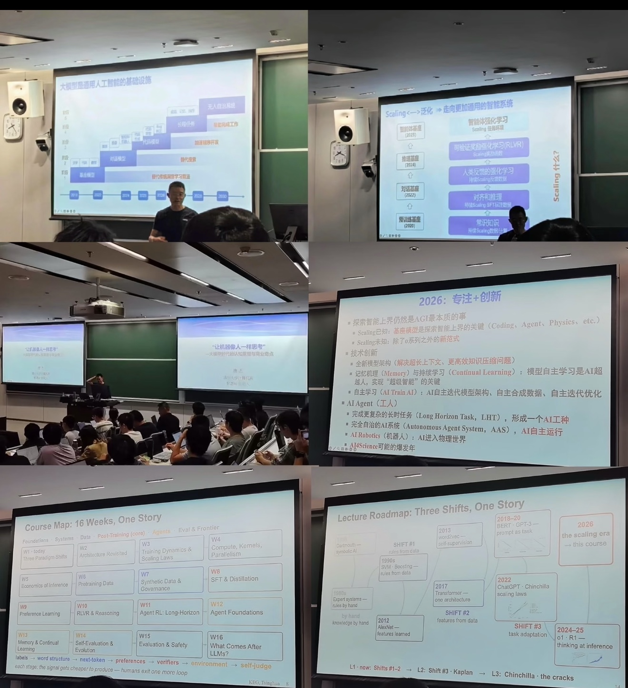

# From Token to Agent · 从 Token 到智能体

> [🇬🇧 English](./README.en.md) · **🇨🇳 中文（默认）**
>
> From Tokenizer, pretraining, and Scaling to RLVR, long-horizon Agents, and Self-Evolution.
> **Walking the full modern-LLM ladder from Token to Agent — hands on.**

---

## Course origin

This repository is a personal reproduction, experiment, and extension based on the **16-week course map and assignment requirements** that Prof. Jie Tang (唐杰) published on 2026-09-17 in Tsinghua's *Advanced Machine Learning* lecture.

The goal is **not** to compress the course into a few demos, but to walk the full chain end-to-end within reachable scale:
- Tokenization & Transformer
- Pretraining & Scaling
- GPU kernels, distributed training, inference systems
- Pretraining & synthetic data
- SFT, Preference Learning, RLVR
- Long-horizon Agent RL
- Harness, Memory & Continual Learning
- Self-Evaluation, Evaluation & Safety

The course PPT delivers a Learning Signal Ladder that runs through all 16 weeks:



The full course plan, weekly experiments, and acceptance criteria live in [`COURSE.md`](./COURSE.md).

---

## Learning Signal Ladder

```text
labels
↓
word structure
↓
next-token
↓
preferences
↓
verifiers
↓
environment
↓
self-judge
```

My reading of the spine:

> Supervised signal gradually migrates from human annotation to data itself, then to Preference, programmatic Verifier, Environment Feedback, and Self-Evaluation; the signal becomes more scalable, and humans exit the feedback loop step by step.

---

## 16-week Course Map

```
W1  Three Paradigm Shifts
W2  Architecture Revisited
W3  Training Dynamics & Scaling Laws
W4  Compute, Kernels, Parallelism
W5  Economics of Inference
W6  Pretraining Data
W7  Synthetic Data & Governance
W8  SFT & Distillation
W9  Preference Learning
W10 RLVR & Reasoning
W11 Agent RL: Long-Horizon
W12 Agent Foundations
W13 Memory & Continual Learning
W14 Self-Evaluation & Evolution
W15 Evaluation & Safety
W16 What Comes After LLMs?
```

Weekly topics, experiments, and acceptance criteria: [`COURSE.md`](./COURSE.md).

---

## 5 stage-gated deliverables

> The 16-week topic list defines **what to learn**. The 5 assignments define **what to deliver**. They overlap and interact — but they are **not** a strict one-week-per-assignment mapping. In particular, the Final Project runs in parallel from W8 and overlaps with HW4.

| Assignment | Main scope | Core deliverable |
| --- | --- | --- |
| **HW1 Foundations** | Tokenization / Architecture / Training | Tokenizer + Transformer + ~0.1B Pretraining + Ablation |
| **HW2 Systems** | Kernel / Parallelism / Inference | Triton Kernel + Multi-GPU + Serving + Cost |
| **HW3 Data + Scaling** | Pretraining Data / Synthetic Data / Scaling Law | Raw Pipeline + Data Card + Scaling Extrapolation |
| **HW4 Post-Training** | SFT / Preference / RLVR / Agent RL | Controlled Comparison (same Base / same Eval / same Cost) |
| **Final Project** | Runs from W8 onward, in parallel with HW4 | Verifiable Env + Harness + Long-Horizon Agent + Self-Judge |

Milestone submission view: [`assignments/`](./assignments/).

---

## Current progress

**Current: W3 complete ✅ — Training Dynamics & Scaling Laws (5-point scaling pilot, 4.23% hold-out error)**

| Assignment | Status |
| --- | --- |
| **HW1 Foundations** | 🟢 complete (W1 tokenizers + W3 scaling pilot + EXT-W1-01) |
| **HW2 Systems** | 🟠 implementation done, ablations shipped (W2 RMSNorm/GQA + W4 Triton started) |
| **HW3 Data + Scaling** | 🟡 W3 scaling pilot done (hold-out 4.23%); W6-W7 data pipeline pending |
| **HW4 Post-Training** | ⚪ not started (W8) |
| **Final Project** | ⚪ not started (W8 proposal kickoff) |

**Recent progress**

- ✅ **W3 scaling pilot — closed loop**: 5 iso-data pilots (1.6M / 3.6M / 6.6M / 14.9M / 32.9M params), val_loss monotonically 4.15 → 3.74 → 3.45 → 3.05 → **2.69**. Chinchilla-style fit `L = 1.53 + 88·N^(-0.245)` on the 4 small points predicts the 20M (32.9M) hold-out at 2.80 vs actual 2.69, **relative error 4.23%**. See `experiments/w03/exp-007/results/fit.md`.
- ✅ **`docs/scaling-law.md`** — W3 textbook deliverable; explicitly lists four boundary conditions (100 steps ≠ convergence, 1 MB corpus too short, vocab not normalized, not a Chinchilla reproduction).
- ✅ **EXT-W1-01** — BPE vocab sweep: saturates at `actual_vocab=530` on the 21 KB toy corpus.
- ✅ **W2 exp-001/002** — RMSNorm vs LayerNorm (+640 params) + MHA vs GQA (4× KV cache shrink). 57/57 tests pass.

Detailed experiments, extensions, and next-step plan: [`ROADMAP.md`](./ROADMAP.md).

---

## Repo layout

```
from-token-to-agent/
├── weeks/         16-week learning & experiment log
├── assignments/   5 assignment + Final submission views
├── src/           unified, evolving implementation (token_to_agent/ namespace)
├── tests/         correctness tests
├── configs/       reproducible experiment configs
├── experiments/   experiment records & results
├── extensions/    off-mainline research experiments (EXT-W<N>-<idx>)
├── docs/          course origin / architecture / paper reading
├── artifacts/     local outputs (gitignored)
├── scripts/       CLI entry points
├── COURSE.md      full 16-week course plan
└── ROADMAP.md     current progress
```

For the `src/` sub-package split, see the top docstring in `src/token_to_agent/__init__.py` and `COURSE.md §23`.

---

## Quick start

> Completed modules ship reproducible entry points. Later modules are filled in as the 16 weeks progress.

```bash
# Install
python -m venv .venv && source .venv/bin/activate
pip install -e .

# Run tests
bash tests/test.sh

# Smoke-test the training pipeline (~5M params, CPU-feasible)
python scripts/train.py --config configs/pretrain/toy-5m.yaml

# HW1 baseline (~100M, needs a GPU host)
python scripts/train.py --config configs/pretrain/baseline-100m.yaml

# W3 scaling pilot — 5 iso-data models + power-law hold-out prediction
# (CPU-feasible; ~40 minutes on Jetson Nano)
bash scripts/run_w3_sweep.sh

# Generate from a checkpoint
python scripts/generate.py --checkpoint artifacts/checkpoints/toy-5m --prompt "你好"

# Attention kernel benchmark (W4 / HW2)
python scripts/benchmark.py attention --backend pytorch triton --seq-len 128 1024
```

> Jetson Nano / CPU hosts are for development and smoke tests only. Production-baseline experiments need a GPU host.

---

## License

Apache 2.0 — see [LICENSE](./LICENSE).

---

## Acknowledgements

- **Course source**: Prof. Jie Tang (唐杰) — *Advanced Machine Learning*, 2026-09-17 — [PPT collage](./docs/course-origin/tang-2026-09-17-aml-ppt-collage.jpg)
- **Research orientation**: THUDM GLM series (GLM-4.5 / GLM-5 / slime / DeepDive / ReST-MCTS / TDRM / AgentTuning / AgentBench / SCALE-CUA / INFTY)
- **Further reading**: [`docs/reading/`](./docs/reading/)